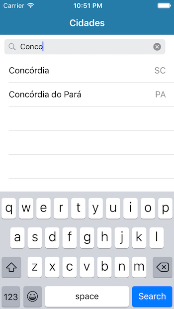

#Previsão do Tempo

######Description:
This app is for you who does not trust in any wheather source and want to choose by yourself which one to use.

######Language:
Brazilian portuguese

######TODO:
- [ ] Settings to choose source
- [ ] Protocols for the API interface with UI

######API Sources

- [x] [INPE - Instituto Nacional de Pesquisas Espaciais](http://servicos.cptec.inpe.br/XML/) (Brazil cities only)
- [ ] [The Wheather Channel](http://www.wunderground.com/weather/api/) (Free developer key)

######Screenshots:

